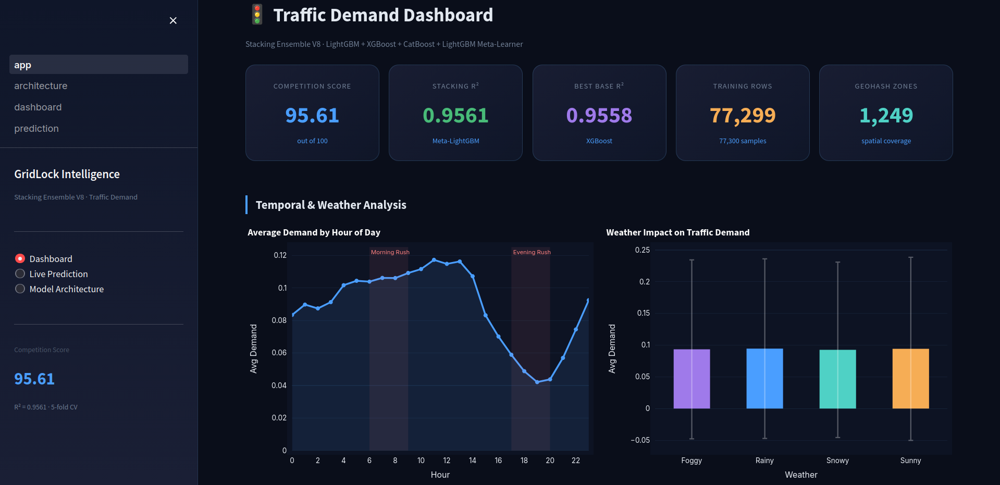
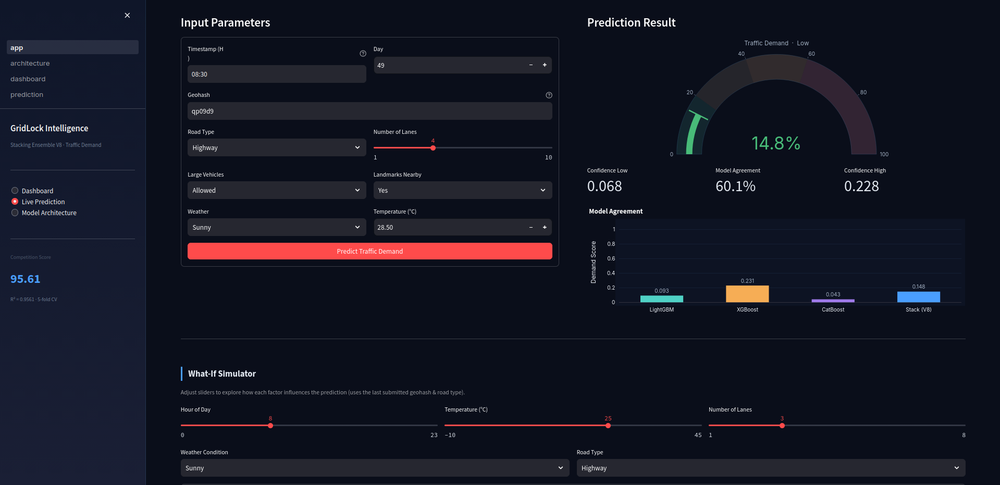
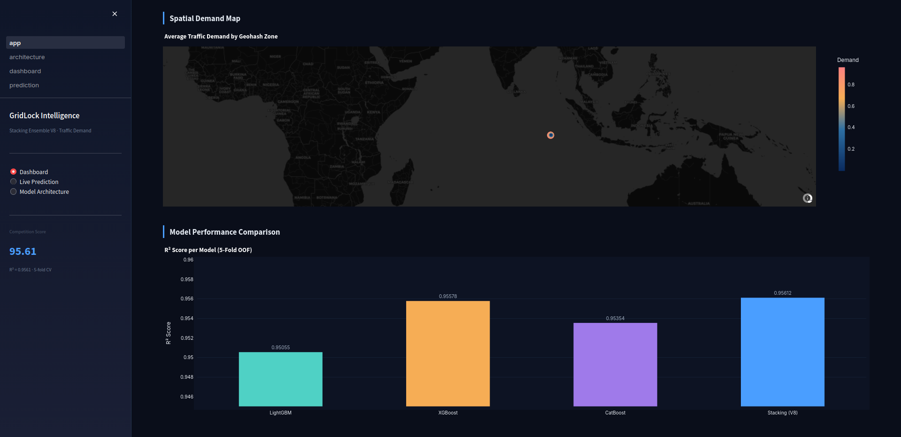
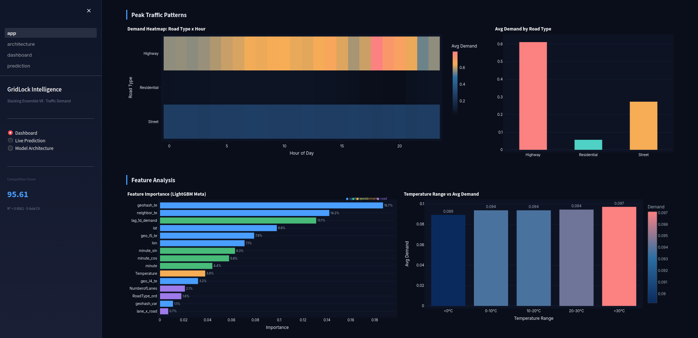
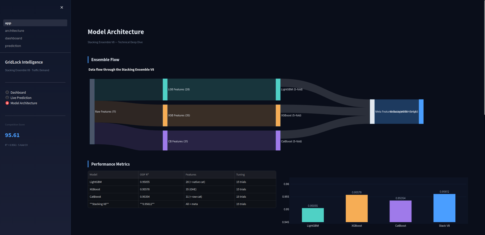

# GridLock Project (Built using Antigravity)

**Traffic Demand Prediction - Stacking Ensemble**

A production-ready machine learning system for real-time urban traffic demand forecasting, built with a stacking ensemble of LightGBM, XGBoost, and CatBoost base models and a Feature-Aware LightGBM meta-learner.

---

## Performance

| Model | OOF R² | Notes |
|---|---|---|
| LightGBM | 0.95055 | 5-fold, 2500 estimators |
| XGBoost | 0.95578 | 5-fold, 2500 estimators |
| CatBoost | 0.95354 | 5-fold, 2500 estimators |
| **Stacking V8** | **0.95612** | Meta-LightGBM, 32 features |

> **Note:** The reported OOF (R^2) score of 0.956 was obtained through 5-fold cross-validation on the training data for local model selection, while the final submitted model achieved a competition leaderboard score of **91.99/100** on the hidden evaluation set.

**Competition Score: 91.99 / 100**  
Training time: ~34 minutes · Dataset: 77,299 rows · 1,249 unique geohash zones

---
## Dashboard

| Dashboard | Prediction |
|------------|------------|
|  |  |

| Analytics | Analytics |
|------------|------------|
|  |  |

### Architecture



```
Raw Input (11 fields)
        │
        ├──► Feature Engineering (29 features)
        │         ├── Temporal: minute, time_slot, sin/cos encoding,
        │         │             peak/night/evening flags, lag-1D demand
        │         ├── Spatial:  lat/lon, geohash target encodings (L4/L5),
        │         │             8-directional neighbor target encoding
        │         ├── Road:     type ordinal, lane interaction, high-volume flag
        │         └── Environment: weather one-hot, temperature, missing indicators
        │
        ├──► LightGBM × 5 folds ──┐
        ├──► XGBoost   × 5 folds ──┼──► [29 base features | LGB | XGB | CB]
        └──► CatBoost  × 5 folds ──┘              (32 meta-features)
                                                        │
                                              Meta LightGBM × 5 folds
                                                        │
                                               Final Prediction [0, 1]
```

---

## Project Structure

```
project/
├── backend/                        # FastAPI REST API
│   ├── main.py                     # Application entry point
│   ├── core/
│   │   └── model_wrapper.py        # Model loading and inference engine
│   ├── routers/
│   │   ├── predict.py              # POST /predict/
│   │   ├── analytics.py            # GET  /analytics/*
│   │   └── model_info.py           # GET  /model-info/*
│   └── schemas/
│       └── predict.py              # Pydantic request/response models
│
├── streamlit_app/                  # Interactive dashboard
│   ├── app.py                      
│   ├── pages/
│   │   ├── dashboard.py            # Analytics charts and KPI cards
│   │   ├── prediction.py          
│   │   └── architecture.py        # Model architecture
│   └── utils/
│       └── data_loader.py          # Cached analytics.json accessors
│
├── model_artifacts/                # Trained model files (these are not tracked by git)
│   ├── lgb_fold_{1..5}.pkl
│   ├── xgb_fold_{1..5}.pkl
│   ├── cb_fold_{1..5}.pkl
│   ├── meta_lgb_fold_{1..5}.pkl
│   ├── ohe_encoder.pkl
│   └── analytics.json         
│
├── scripts/
│   └── precompute_analytics.py     # One-time analytics generation from train.csv
│
├── dataset/
│   └── train.csv                   # Training data (these are not tracked by git)
│
├── requirements.txt
└── run.sh                          # Start services using one command
```

---

## Quick Start

### Prerequisites

- Python 3.10+
- `train.csv` placed in `dataset/`
- Trained model `.pkl` files placed in `model_artifacts/`

### Run (one command)

```bash
bash run.sh
```

This script will:
1. Create a Python virtual environment (`venv/`)
2. Install all dependencies from `requirements.txt`
3. Pre-compute `analytics.json` if not already present
4. Start the FastAPI backend on port **8000**
5. Start the Streamlit dashboard on port **8501**

### Manual Start

```bash
# Activate the virtual environment
source venv/bin/activate

# Terminal 1 — FastAPI backend
python -m uvicorn backend.main:app --host 0.0.0.0 --port 8000 --reload

# Terminal 2 — Streamlit dashboard
streamlit run streamlit_app/app.py --server.port 8501
```

---

## API Reference

Base URL: `http://localhost:8000`  
Interactive docs: `http://localhost:8000/docs`

### POST /predict/

Run a real-time traffic demand prediction.

**Request body:**

```json
{
  "timestamp":     "08:30",
  "geohash":       "qp09d9",
  "day":           49,
  "RoadType":      "Highway",
  "NumberofLanes": 4,
  "LargeVehicles": "Allowed",
  "Landmarks":     "Yes",
  "Weather":       "Sunny",
  "Temperature":   28.5
}
```

**Response:**

```json
{
  "demand":           0.4721,
  "confidence_low":   0.4312,
  "confidence_high":  0.5130,
  "lgb_pred":         0.4650,
  "xgb_pred":         0.4783,
  "cb_pred":          0.4731,
  "traffic_level":    "High",
  "model_agreement":  0.874
}
```

### GET /predict/status

Returns current model registry state and fold counts.

### GET /analytics/hourly-trend

Returns average traffic demand per hour of day (0–23).

### GET /model-info/architecture

Returns full pipeline architecture descriptor.

---

## Model Artifacts

The following files must be present in `model_artifacts/` for predictions to work:

| File | Size | Description |
|---|---|---|
| `lgb_fold_{1..5}.pkl` | ~6–10 MB each | LightGBM base models |
| `xgb_fold_{1..5}.pkl` | ~33–42 MB each | XGBoost base models |
| `cb_fold_{1..5}.pkl` | ~7–11 MB each | CatBoost base models |
| `meta_lgb_fold_{1..5}.pkl` | ~150–225 KB each | Meta LightGBM models |
| `ohe_encoder.pkl` | ~1 KB | Sklearn OneHotEncoder |
| `analytics.json` | ~130 KB | Pre-computed dashboard analytics |

---

## Dependencies

```
fastapi          uvicorn[standard]   pydantic
streamlit        plotly              pandas
numpy            pygeohash           scikit-learn
lightgbm         xgboost             catboost
joblib           requests
```

Install via:

```bash
pip install -r requirements.txt
```

---

## Feature Engineering

| Category | Features |
|---|---|
| Temporal | `minute`, `time_slot`, `minute_sin`, `minute_cos`, `is_peak_am`, `is_night`, `is_evening`, `lag_1d_demand` |
| Spatial | `lat`, `lon`, `geohash_te`, `geo_l4_te`, `geo_l5_te`, `neighbor_te`, `geohash_var` |
| Road | `RoadType_ord`, `NumberofLanes`, `IsHighVolumeLane`, `lane_x_road`, `LargeVehicles_bin`, `Landmarks_bin`, `road_lanes_key_te` |
| Environment | `Temperature`, `weather_Sunny`, `weather_Rainy`, `weather_Foggy`, `weather_Snowy` |
| Indicators | `RoadType_missing`, `Temp_missing`, `Weather_missing` |

---

## Development

### Run API tests

```bash
# Health check
curl http://localhost:8000/health

# Single prediction
curl -X POST http://localhost:8000/predict/ \
     -H "Content-Type: application/json" \
     -d '{"timestamp":"08:30","geohash":"qp09d9","RoadType":"Highway","NumberofLanes":4,"Weather":"Sunny","Temperature":28.5}'
```

### Regenerate analytics

```bash
source venv/bin/activate
python scripts/precompute_analytics.py
```

---

## Deployment
TBD
---

## License

This project is built for competition/research purposes.
